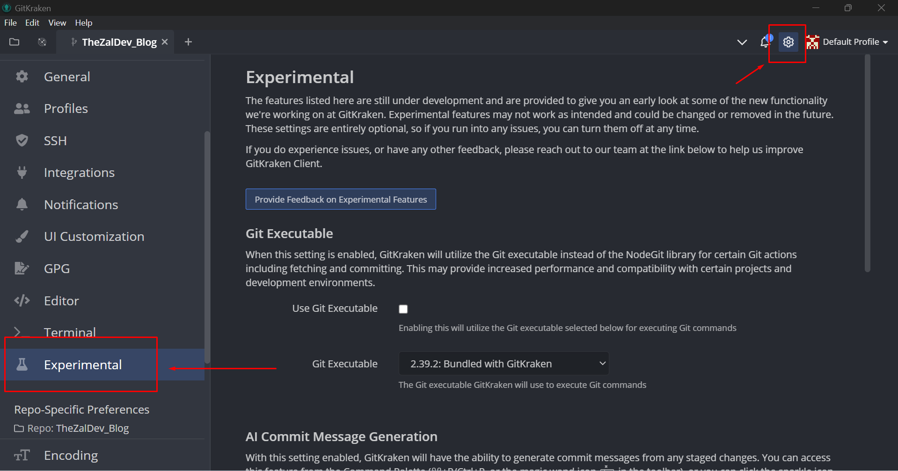
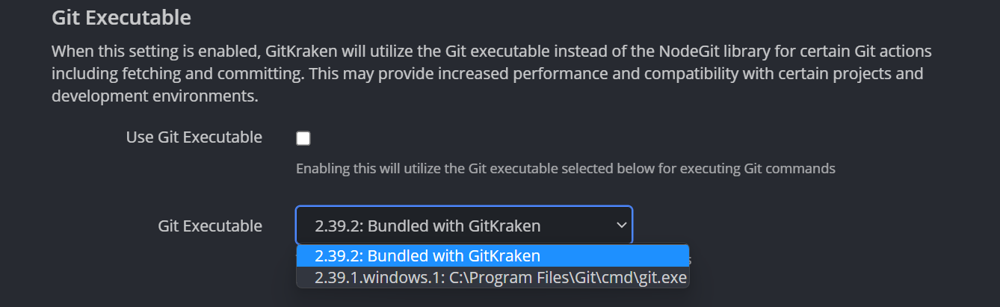

Hello There! TheZal here and today I'm gonna show you how to take a look to the future inside GitKraken!

I'll divide this article in three sections:

- [A quick view to the Experimental Section](#a-quick-view-to-the-expertimental-section)
- [The first experimental feature: Bundled Git Executable](#the-first-experimental-feature-bundled-git-executable)
- [The second experimental feature: AI Generated Commit Messages](#the-second-experimental-feature-ai-generated-commit-messages)

## A quick view to the Expertimental Section

With the release of the 9.4.0 version of GitKraken the `Experimental` section has been added to the `Preferences` menu.

In this section are listed the features currenty in development and are being shared to provide you with an early glimpse of the new functionalities that the GitKraken team is working on. It is important to keep in mind that experimental features may not function as intended and are subject to potential modifications or removal in future updates. These settings are entirely optional, meaning that if you encounter any issues, you have the flexibility to disable them at any time.

## The first experimental feature: Bundled Git Executable

Enabling this setting in GitKraken allows the utilization of the Git executable instead of the NodeGit library for specific Git actions, such as fetching and committing. By doing so, you may experience improved performance and enhanced compatibility with certain projects and development environments.

In the dropdown menu is possible to select even an executable of git not bundled with GitKraken but installed in your system.

## The second experimental feature: AI Generated Commit Messages

If you found this useful feel free to reach me on [Twitter](https://twitter.com/TheZalDev), [GitHub](https://github.com/TheZal), or [mail](mailto:rick.zal239@gmail.com) and share it with your dev friends!
